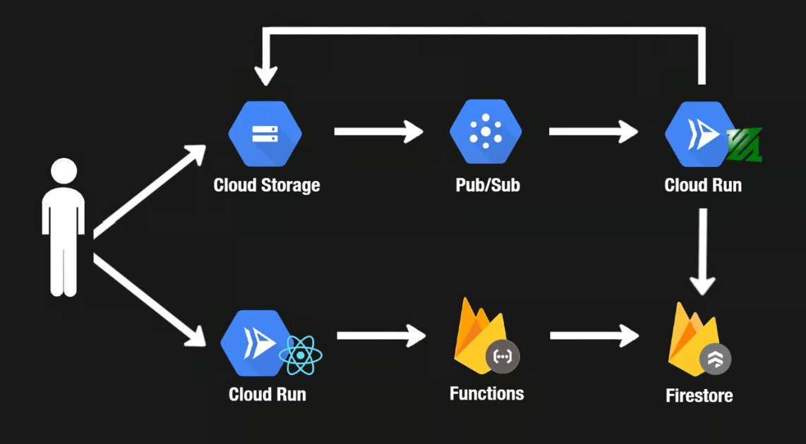

# YouTube-Clone Project
Built a skeleton of the Youtube web app where you can List videos, Watch a video, Sign in/out, Upload a video and Watch the transcoded video. 

## Architecture
The app has the following architecture:

## General Idea
- Cloud Storage stores the raw and processed videos uploaded by users.
- Pub/Sub acts as a message queue and sends messages to the video processing service.
- Cloud Run hosts a non-public video processing service. After it transcodes videos, they are uploaded to Cloud Storage, and Cloud Run uploads the video metadata to Cloud Firestore.
- Cloud Firestore stores the metadata for the videos.
- Cloud Run also hosts a Next.js app, which serves as the YouTube web client.
- The Next.js app makes API calls to Firebase Functions.
- Firebase Functions fetches videos from Cloud Firestore and returns them to show on the app.

*nb. This project was inspired by neetcode.io and has a similar tech stack and architecture*
